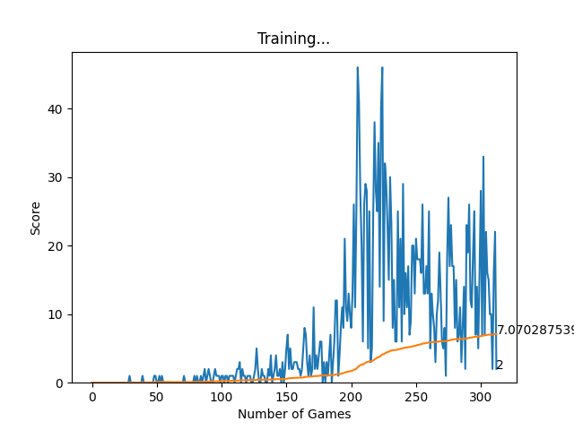

# Snake-AI
Built an AI model which uses DQN and Pytorch that is able to play snake at a high level.
It saves the model with the best score after each training session.

## Setup
To run this yourself, make sure you have:
* Python
* Pytorch

Then just run the agent.py file to start the training proccess. To stop training, close the pygame window.
The best model(the model that achieves the highest score) will be saved in the model folder.
*model_saved contains pretrained models*

# Statistics and Observations
On average the model should be able to obtain a highest record in the high 30s and the mean score shown on the graph is not a very reflectative of the model's accuracy as it includes the exploration games.

Below is the AI which had trained for around 350 games,

This is the graph that is drawn during training and allows for real time insight on how the model is doing.
From this graph, we can see that at game 205, this particular verision of the model achieved a highscore of 46. Again at game 225 the model achieved this score again. With further optimization and training on these two particular models, it is possible to exponentially increase the potential of this AI.

